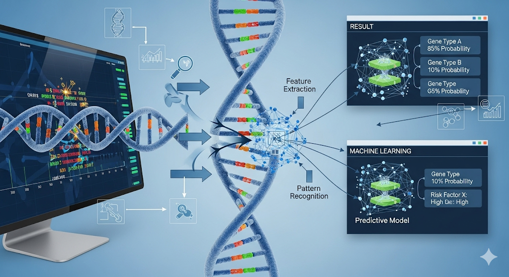
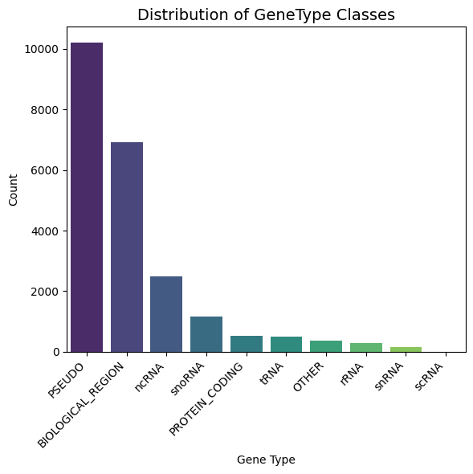
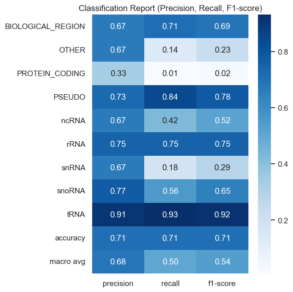

# 🧬 DNA Sequence Analysis & Gene Type Prediction using ML



A **machine learning** project for analyzing DNA sequences and predicting gene types. This notebook demonstrates data exploration, visualization, and classification using n-gram features and **logistic regression**. Perfect for bioinformatics, genomics, and ML enthusiasts!

---

## 🛠️ Tools & Technologies Used


---

## 📂 Project Directory Structure

```
DNA Sequence Analysis/
├── dataset/
│   ├── train.csv
│   ├── validation.csv
│   └── test.csv
└── src/
│   └── main.ipynb
└── readme.md
```

---


## 📚 Project Overview

This project explores DNA sequence data and predicts gene types using machine learning:

- **Data Exploration**: Visualize sequence length, nucleotide composition, and gene type distribution.
- **Feature Engineering**: Extract n-gram features from DNA sequences.
- **Modeling**: Train a logistic regression classifier to predict gene types.
- **Evaluation**: Assess model performance with accuracy, confusion matrix, ROC curves, and feature importance.


## Dataset 
DNA sequence prediction is a crucial task in bioinformatics, enabling researchers to analyze genetic patterns, predict mutations, and model gene structures. This dataset can be used to implement three machine learning approaches to predict nucleotide sequences

We use nucleotide sequences of human genes from the NCBI Gene Database. The dataset consists of:

1. Gene symbols, descriptions, and types.
2. Nucleotide sequences represented as A, T, C, G.
3. Train-validation split: 80% training, 20% testing




---

## Installation & Setup Guide

Get started in minutes!

### 1️⃣ Install Python & Jupyter

```bash
pip install notebook
- Download [Python 3.10+](https://www.python.org/downloads/)
- Install Jupyter Notebook:
  ```bash
  pip install notebook
  ```

### 2️⃣ Install Required Packages

```bash
pip install pandas numpy matplotlib seaborn scikit-learn tabulate
```

### 3️⃣ Clone the Repository

```bash
git clone https://github.com/yourusername/dna-sequence-ml.git
cd "DNA Sequence Analysis"
```

### 4️⃣ Launch the Notebook

```bash
jupyter notebook src/main.ipynb
```

---

## Core Features

| **Function**                | **Purpose**                                      |
|-----------------------------|--------------------------------------------------|
| Data Cleaning               | Remove missing/duplicate entries, standardize text|
| Exploratory Visualization   | Sequence length, gene type, nucleotide frequency  |
| N-gram Feature Extraction   | Character-level n-gram encoding for ML            |
| ML Model Training           | Logistic regression for gene type classification  |
| Model Evaluation            | Accuracy, confusion matrix, ROC, feature importances|

---

## Classification Report



## 🌟 Why This Project?

- Learn practical ML for bioinformatics
- Explore real DNA sequence data
- Visualize and interpret genetic features
- Build and evaluate a robust classification model

### Example Scenario

Given a DNA sequence, the model predicts its gene type using learned n-gram patterns. Visualizations help understand sequence structure and model decisions.

---

##  Future Enhancements

- 1. Add deep learning models (LSTM, Transformer)
- 2. Integrate external genomic databases
- 3. Interactive dashboards with Plotly
- 4. Deploy as a web app for public use

---

## 📚 Resources

- [Scikit-learn Documentation](https://scikit-learn.org/stable/)
- [Pandas Documentation](https://pandas.pydata.org/docs/)
- [Seaborn Documentation](https://seaborn.pydata.org/)
- [Bioinformatics Tutorials](https://www.ncbi.nlm.nih.gov/education/)

---

## 🙌 Contributing

Have ideas or improvements? Fork the repo, make changes, and submit a pull request! Let’s advance bioinformatics together. 😄

⭐ **Star the repo** if you find it useful!

---

## 📬 Contact

**Maintainer**: hafsasudheer92@gmail.com

Questions, feedback, or collaboration? Reach out anytime! 👋

---

💡 **Pro Tip**: For best results, ensure your CSV files are clean and formatted as described in the notebook. If you encounter issues, check your Python and package versions!
